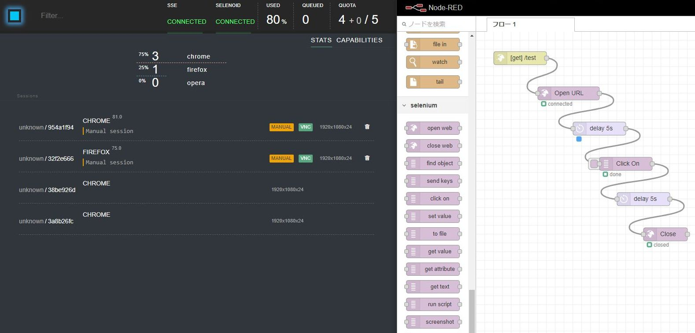

# selenoid-node-red
Selenoid + Node-RED



#### Setup

```
$ docker-compose build
```

If [direnv](https://direnv.net/) is installed, `./bin` is no longer required (optional)

```
$ apt install direnv

$ cd path/to/selenoid-node-red
$ direnv allow
```

#### Node-RED

```
// Start Node-RED
$ ./bin/node-red
```

[localhost:1880](http://localhost:1880)

#### Selenoid

Get Configration Manager

```
$ make bin/cm

$ ./bin/cm version
Git Revision: 1.7.1
UTC Build Time: 2019-10-08_05:28:51PM
```

Start Selenoid

```
$ ./bin/cm selenoid start --vnc
$ ./bin/cm selenoid-ui start
```

[localhost:8080](http://localhost:8080)
